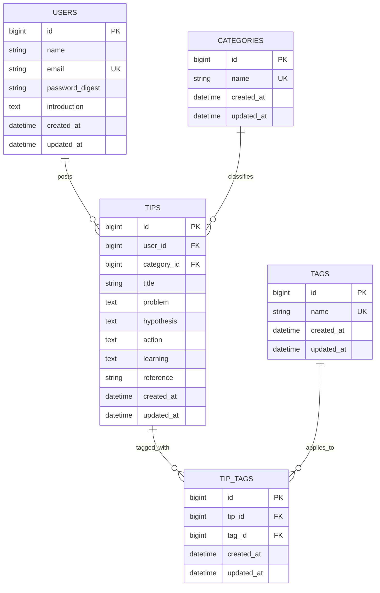
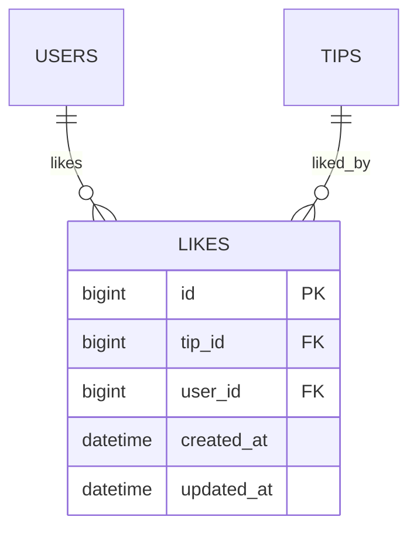

# 学習Tipsお悩み相談所 — 設計書 v2（W3修正反映版）

> 本ドキュメントは初期設計書（`learning_tips_consultation.md`）に、OBLスプリントW3修正スケジュールでの意思決定を統合した最新版である。初期設計からの変更点は `design_changelog_w3.md` を参照。

## UI コンセプト

**コアイメージ**: 付箋・ノート・フォルダ — 知識の整理と共有の場。

交流が生まれる暖かいイメージは維持しつつ、より学習にフォーカスした雰囲気へ。このアプリの設計コア（暗黙知の可視化・個人のハウツーの共有）を体現するため、パブのような社交的UIではなく、付箋・手書きノート・フォルダをモチーフにしたUIを採用する。

| 要素 | 旧イメージ（パブ） | 新イメージ（学習ワークスペース） |
|---|---|---|
| 雰囲気 | 社交的・賑やか | 暖かい・集中できる |
| モチーフ | 木のカウンター・暖炉 | 付箋・ノート・フォルダ |
| 色調 | アンバー・ダークウッド | クリーム・ペーパーホワイト・アクセントカラー |
| Tips投稿カード | バーのメニュー風 | 付箋・インデックスカード風 |
| カテゴリ整理 | タブ（フラット） | フォルダ・タブ仕切り風 |

**設計意図**: 暗黙知・個人のハウツーという無形の知識を「書き留めたもの」として可視化する。ユーザーが「誰かのノートを読む」感覚で情報にアクセスできるUIにする。

## 1. 課題（Why）とペルソナ（Who）の深掘り

### 解決したい課題と分解の特定

#### noteでの記事探索の課題
- たくさんのtips記事がnote、Qiitaでシェアされているが探すのがめんどくさい

**Q：何がめんどくさいのか？調べる時の1番の障壁は？**
- 何を参照したら良いのかが分からない
- どの方法が自分にとって良いのかピッタリしない
- 文字情報だと読むのが少し億劫になる
  - えのさんのfigma掲示板UIはなんか見やすい...

#### コミュニケーションの課題
**Q：何で相談できなかったり悩んだりするのか？**
- 人と話すのが心理的・時間的なハードルが高い人がいる
  - 確かに「話しましょう」でも難しいよな
  - 相手の情報を知らないので話すのが怖い
  - 本業をしながらでコミュニティーと時間が合わない
  - 参加を億劫に感じる（個別なら話を聞ける）

#### 入力側の負担
**Q：入力側の負担をどう軽減するか？**
- シェアする側も書くのはめんどくさいという課題がある
  - 対策：セクションを作成してあえて負荷を減らす
  - 行動セクションを設ける
    - 参照者も分かりやすい
    - AIでの検索も楽になる

#### ユーザーの不安
「他の受講生はどんな勉強しているの？」「技術面談はどうやって使うの？」「カリキュラムの進捗は？」とRUNTEQ生活に不安がある人が、この掲示板を利用することで少しでもヒントを得られるようにする。

### 具体的なユーザー像（ペルソナ）
- 本業をしながら学習していてコミュニティーへの参加時間が合わない、心理的ハードルが高い人
- 学習方法がわからず、どうしたら良いのかわからず悩んでいる人
- 知識をシェアしてハッピーになりたい人/誰かを助けたい人
- 要点だけスパッと確認して実践したい人

### コンセプト定義：「誰の、どんな瞬間を救うアプリなのか」

#### ユーザーの課題感
- 誰かに相談したら良いか分からない
- コミュニティへの参加時間がない、少し億劫
- 自分から話を聞くのは勇気がいる
- 大勢の場所で発言するのは心理的ハードルが高い
- 何か参考になる投稿ないかな...

#### ソリューション
tips掲示板を参考にすることで、時間がない人でも知りたいことだけをすぐに知れる。悩みに対する回答を得ることができる。
自分と同じ境遇の人が書いたTips」を瞬時に抽出できるようになり、アプリの核となる体験

#### ゴール状態
**Q：ユーザーがどんな状態になったらゴールか？**

**A：**この掲示板を利用することで悩んでいることを誰に相談したら良いのかがわかるようになる。

**例）**〇〇さんは「AIプロンプト」についてtips紹介しているから、〇〇さんに話しかければ良いか...

## 2. ユーザビリティと体験設計（How）

### 入力側の体験設計（Tipsシェアする側）

#### 入力負荷の軽減策
- **構造化されたフォームテンプレート**
  - 「課題」「仮説・思考」「具体的な行動」「学び」のセクション分け
  - **設計意図**: 構造化により「何を書けばいいか分からない」問題を解消。思考プロセスの流れに沿ったセクション分けで、投稿者は自然に記入でき、閲覧者は理解しやすくなる。
  - 各セクション100〜200文字程度のライトな入力を想定
  - マークダウン不要、プレーンテキストで完結、テンプレを準備しておく
- **カテゴリの事前選択**
  - 投稿フォームの最後にラジオボタンから選択
- **バックグラウンド情報の再利用**
  - 一度プロフィールを登録すれば、投稿時は自動付与
  - 「本業あり/なし」「未経験」「実務経験あり」などタグ形式

### 閲覧側の体験設計（Tips参照する側）

#### 探索のハードル削減
- **ビジュアル優先のUI**
  - カテゴリタブ + タイトル表示 ＋ リスト形式 + アイコン表示
  - 「文字の壁」を感じさせないデザイン

- **AI提案機能（軽量版）**
  - 「今こんなことで悩んでます」と入力 → 関連Tipsを3〜5件提示
  - ユーザープロフィールを事前登録していれば、パーソナライズされた提案

#### 成功状態の定義
- **短期的成功指標**
  - ユーザーが「3分以内」に求めているTipsに辿り着ける
  - Tips閲覧後、「参考になった」ボタンを押下
  - 投稿者プロフィールを確認し、「この人に相談したい」と思える
  - 「誰に相談すれば良いかわからない」状態から「〇〇さんに聞けば良いか」とわかる状態へ

## 3. MVPスコープの決定（削ぎ落とし）

---

### フルスペック機能リスト（理想形）
- **カテゴリ別掲示板**
  - 「アウトプット」
  - 「インプット方法」
  - 「技術面談活用方法」
  - 「おすすめAI活用方法/プロンプト」
  - 「過去の推しアーカイブ動画」
  - などのカテゴリごとにtipsがまとめられている掲示板

- **AI提案機能**
  - AIが内蔵されており、ユーザーの悩みに応じて参照すべき学習tipsを提案してくれる
- **Tips作成者情報の参照**
  - バックグラウンドの記入（モーダルで簡単なプロフィールが確認できる | 主婦、子育て中など）
- **tipsランキング**
  - 掲示板参照数ではなくtipsそのものへの評価

### MVP v1.0（5機能 — デプロイ優先）

OBLスプリント前半2週間の実績（実装速度が計画の~50%）を踏まえ、デプロイ完了を最優先とし5機能に集中する。

#### 含める機能（MUST）

1. **ユーザー登録・認証機能**
   - ユーザー名：name
   - メールアドレス：email
   - 自己紹介：150字：introduction
   - パスワード：password_digest
   - 登録したユーザーは、メールアドレスとパスワードを使用してログインおよびログアウトができます。

2. **Tips投稿機能**
   - **設計意図**: 投稿者の思考プロセス（課題認識→仮説立案→実行→学び）を可視化することで、暗黙知をシェアする。閲覧者は「なぜその方法を選んだのか」を理解でき、「この人に相談したい」という発見につながる。
   - 構造化フォーム（タイトル/課題/仮説・思考/具体的な行動/学び/参考URL）
   - tipsシェアを押すと投稿フォームページ（/tips/new）へ画面遷移する
   - 参考記事もしくは動画を投稿するURLセクション
   - タグ追加: 事前定義によるタグの追加

3. **Tips一覧・カテゴリタブ機能**
   - タブ切り替えによるカテゴリ選択（3〜5種類に絞る：「学習方法」「技術面談」「AI活用」など）
   - リストによる一覧の表示。投稿タイトルで流し読みできるようにする
   - Tipsポストに対してのタグ

4. **Tips詳細表示機能**
   - Tipsの全内容表示（タイトル/課題/仮説・思考/具体的な行動/学び/参考URL）
   - 投稿者プロフィール簡易表示（テキスト情報のみ）

5. **プロフィール表示・編集機能（テキストのみ）**
   - 名前・自己紹介テキストの表示・編集
   - 画像アップロードなし（carrierwave/画像はv1.5へ。デプロイ時の本番環境設定の複雑性を回避するため）

#### v1.5で追加する機能
- **いいね機能 + いいね一覧ページ**
  - Tipsにいいねができる（ログインユーザーのみ）
  - いいね済みの場合はアイコン切り替えで視覚的にフィードバック
  - **いいね一覧ページ**（`/likes`）：自分がいいねしたTipsをまとめて確認・再参照できる
  - 同一ユーザーが同一Tipsに複数いいね不可（`user_id + tip_id` のユニーク制約）
- **ページネーション (kaminari)**
- **プロフィール画像アップロード (carrierwave)**
- ランキング表示、カテゴリ拡充、タグ絞り込み機能（ransack）

#### 後回しにする機能（v2.0）
- コメント機能（まずはコア価値である暗黙知のシェアと閲覧に集中）
- AI提案機能（まずは手動検索で十分）
- キーワード検索（まずはカテゴリタブとタグ絞り込みで十分）

#### 削ぎ落としの判断基準
- **コア価値**：「誰に相談すれば良いかわかる」「自分に合ったTipsがすぐ見つかる」「暗黙知のシェアと閲覧」
- **デプロイ優先**: 実装速度が計画の~50%であるため、デプロイ完了を最優先としスコープを縮小
- **技術的複雑さ vs 価値**: AI機能は高コスト・低優先度（まずは人の力で回す）
- **本番環境の複雑性回避**: carrierwave等の画像関連はデプロイ時の設定が煩雑になるためv1.5に回す
- **初期データ問題**: Tipsが少ない初期は、シンプルな一覧＋フィルタで十分

### 段階的リリース計画
- **v1.0 (MVP)**: ユーザー認証 + Tips投稿 + Tips一覧・カテゴリタブ + Tips詳細表示 + プロフィール表示・編集（テキストのみ）— 5機能
- **v1.5**: いいね機能 + いいね一覧、ページネーション(kaminari)、プロフィール画像(carrierwave)、ランキング表示、タグ絞り込み(ransack)
- **v2.0**: コメント機能、AI提案機能、検索機能(pg_search)、アーカイブ動画セクション

## 4. 懸念点の洗い出し（リスク管理）

### 既知の懸念事項（元からあった内容）
- Tipsを作成する側の作成負担やコストもある
- 前提としてtipsがないと意味がない
- とにかく閲覧する時のハードルは下げたい
- 作成者のバックグラウンドや状況を明確にしたい

---

### リスク詳細と対策

#### リスク1：初期データ不足（冷やし掲示板問題）
**内容**: リリース時にTipsが少ないと価値が提供できない

**対策**:
- **シード投稿の準備**: 運営側で10〜20件のTipsを事前投稿
- **コアユーザーの巻き込み**: リリース前に5〜10名のアーリーアダプターを募集し、事前投稿を依頼
- **note記事のインポート**: 既存のnote記事を構造化して移行（許可を取った上で）

**判断基準**: 各カテゴリに最低5件のTipsがないとリリースしない

---

#### リスク2：投稿ハードルの高さ
**内容**: 「書くのがめんどくさい」でTipsがシェアされない

**対策**:
- **超軽量フォーム**: 各セクション100文字程度でOKとする
- **テンプレート例文の提示**: 「例：Railsのルーティングで詰まった時、〇〇を試したら解決した」
- **インセンティブ設計（将来）**: 「参考になった」が多い投稿者をバッジで表彰など

---

## 5. 技術選定と調査

### 前提（この調査で固定する方針）
- ミニアプリレベル（Rails標準技術スタック中心、コア機能のみでリリース優先）
- シンプルな認証のみ（`password_digest` + `bcrypt` + セッション認証）
- MVP版はテキストベースのみ（carrierwave/画像アップロードはv1.5。デプロイ時の本番環境設定の複雑性を回避）
- UIはタブ切り替え＋シンプルなリスト表示。daisyUIを採用し、UIはAIで代替する
- Rails + Hotwire を前提（UI基盤は erb + TailwindCSS + daisyUI）
- いいね機能はv1.5で実装（MVP版は5機能に集中）
- Docker環境では作らずに最速でデプロイを目指す

### 調査カテゴリ

#### 1. フロントエンド技術スタック
- タブ切り替え＋シンプルなリスト表示の実装
  - Rails標準のerb + TailwindCSS + daisyUI
  - タブUI（シンプルなCSSクラス切り替え）
- Tailwind vs daisyUI
  - Tailwindは自作をする必要。卒制としては使い回しができそうなイメージがあるが、一旦は置いておいて作ることを意識
  - 決定：daisyUIを使う
- モーダル表示の実装パターン（投稿者プロフィール詳細表示用）：Rails 7系でアプリ開発を実施したときに標準であるstimulusを使用

#### 2. バックエンド・ルーティング設計
- Railsの標準的なRESTful設計（resources routing）
- Tips投稿のバリデーション（モデルレベル、presence/lengthなど）
- フィルタリング・ソート処理（scopeの活用、シンプルなwhere/order）
  - ミニなので複雑なソートはなし。それよりもAIでの抽出に移行することを試したいので、カテゴリUIで分類されている前提
  - ソートはcreated_at DESC で固定
  - フィルタはなし：要望があれば。

- 掲示板情報の検索：**フェーズ別の技術選定（確定）**

  **ユーザーの検索行動モデル**
  ユーザー探索の心理として他の受講生がどんなことをしているのかを探索するための記事版。かつ、ミニ段階では投稿内容も少ないことが想定されるので
  - 「キーワードを入れて関連記事を探す」（Google型）ではなく
  - 「自分に近い状況の人のtipsを絞り込む」（フィルター型）
  - 例：「本業ありで未経験の人のAI活用tipsが見たい」
    → カテゴリ: AI活用 × タグ: 本業あり × タグ: 未経験

  | フェーズ | 機能 | 採用技術 | 根拠 |
  | --- | --- | --- | --- |
  | v1.0 MVP | カテゴリタブ切り替え | gem不要 | `where(category_id: params[:category_id])` で完結 |
  | v1.5 | タグ・バックグラウンドでの絞り込み | **ransack** | 構造化データのフィルタリングが本質 |
  | v2.0 | 「〇〇で悩んでます」自由記述検索 | pg_search | 自然言語 × 関連度ランキングが必要になる段階 |

  ※タグ機能は段階導入：v1.0で「投稿時のタグ付与（選択式）」のみ実装し、v1.5でタグ絞り込みを追加する。

  **v1.5で ransack を採用する理由**
  1. ユーザーの探索行動が「属性フィルター型」→ タグ名のマッチングで完結
  2. `tags_name_in` predicate でシンプルなChain可能
  3. フォームヘルパーでフィルターUIが即完成（開発速度優先の方針と整合）
  4. データ数が少ない初期段階では全文検索の恩恵がない
  5. v2.0でpg_searchを追加しても設計変更が最小

  **pg_searchはv1.5では早すぎる**
  →「悩みを自由記述で入力して関連tipsを見つける」体験が必要になるv2.0以降が本来の出番
  → v2.0のAI機能との連携方針次第で位置づけが変わる（OpenAI API完全委託ならpgvectorの検討の方が価値あり）


- ページネーション kaminari：v1.5で実装（デプロイ優先のためMVPからスコープ縮小）
  - キーワード検索：ミニ開発段階では実装はしない。openaiの検索機能とransackとpg_searchの違いリサーチと検証の時に行うで良いことにする

- **タグ設計の判断（確定）**

  タグは「誰がつけるか」によって実装が変わる：
  - パターンA：**開発者がタグを事前定義、投稿者は選ぶだけ**（チェックボックスUI）← このアプリの採用方針
  - パターンB：投稿者が自由入力（表記ゆれ発生 → 「3分以内に見つかる」体験を破壊する）

  **採用：シンプルなTag + 中間テーブル（acts-as-taggable-onは不採用）**

  | 観点 | acts-as-taggable-on | シンプルなTag + 中間テーブル |
  | --- | --- | --- |
  | タグが自由記述（ユーザー入力） | 本領発揮 | 管理が大変 |
  | タグが開発者定義の選択式 | オーバースペック | これで十分 |
  | ransackとの相性 | 要設定 | `tags_name_in` でシンプル |
  | 開発コスト | gem習熟コストあり | Railsの基本知識で実装可 |

  acts-as-taggable-onが真に輝くのは「ユーザーが新しいタグを生み出す」UXの時（Twitterのハッシュタグ的体験）。
  このアプリのタグは「探索の座標軸」であり、開発者が設計するもの。v2.0以降で自由入力が必要になった段階で検討。

  **タグの分類レイヤー**
  ```
  第1層：カテゴリ（tips.category_id）
          学習方法 / 技術面談 / AI活用
          → タブUIで切り替え

  第2層：タグ（Tag テーブル + tip_tags 中間テーブル）
          [バックグラウンド] 本業あり / 未経験 / 実務経験あり
          [技術]             Rails / SQL / Ruby
          [難易度]           初心者向け / 中級者向け
          → チェックボックスUIで絞り込み（ransack: tags_name_in）

  第3層：プロフィール（Userの属性から投稿時に自動付与も可）
  ```

#### 3. 認証・ユーザー管理
- gem bcryptでの基本認証実装（email/password）
- セッションベースのシンプル認証を採用（MVPでは確認メールやOAuthは実装しない）

- ユーザープロフィール管理
  - 本業有無: True/false??
  - 学習タイプをテキストで書く
  - MVP版: 名前・自己紹介テキストの表示・編集のみ（画像アップロードなし）
  - carrierwaveでのアイコン画像アップロード・表示 → v1.5で実装
    - 意図：CarrierWaveを使用する。DBに画像取得用のパスのstring形式のカラムを追加するだけで良いから
    - v1.5に移行した理由：デプロイ時の本番環境設定の複雑性を回避

- carrierwaveの基本設定（ローカルストレージ、画像リサイズはMiniMagick）→ v1.5で実施

#### 4. データベース設計

**設計意図：思考プロセスの可視化による暗黙知のシェア**

このアプリのコア価値は「誰に相談すれば良いかわかる」「自分に合ったTipsがすぐ見つかる」状態の実現。そのために、単なる解決策の羅列ではなく、**投稿者の思考プロセス全体**を構造化して記録する設計とした。

**tipsテーブルの設計思想:**
- **`problem`（課題）**: 何に困っていたかを明確化。閲覧者が「自分と同じ課題か」を瞬時に判断できる座標軸。
- **`hypothesis`（仮説・思考）**: **最重要カラム**。どう解決すると考えたか、なぜそのアプローチを選んだかを記録。同じ課題でも仮説が違えば解決策が変わるため、思考プロセスの可視化こそが暗黙知のシェアの本質。
- **`action`（具体的な行動）**: 実際に何をしたかを記録。閲覧者が即座に実践できる情報。
- **`learning`（学び）**: 結果（成功/失敗）と気づき、他の人へのアドバイスを統合。投稿者の経験知を凝縮。
- **`reference`（参照URL）**: 詳細な解説は外部リンクに委ね、フォームはエントリポイントとして軽量化。

この設計により、閲覧者は「課題→仮説→行動→学び」の流れで投稿者の思考を追体験でき、「この人に相談したい」という発見につながる。

- テーブル設計
  - `users`（プロフィール、アイコン保存パス）
  - `tips`（構造化フィールド：problem/hypothesis/action/learning + カテゴリ外部キー）
  - `categories`（カテゴリマスタ）
  - `tags`（v1.0〜 / 開発者がseedsで事前定義。nameとcategoryカラムで分類管理）
  - `tip_tags`（中間テーブル / tips と tags の N:M を解決。v1.0は投稿時の付与のみ）
  - `likes`（中間テーブル / users と tips の N:M を解決。いいね一覧ページの元データ）→ **v1.5で実装**
  - `comments`（v2.0〜 / Tipsへのコメント投稿機能）
- インデックス設計
  - `tips`: `category_id`, `user_id`, `created_at`
  - `tip_tags`: `tip_id`, `tag_id`（複合ユニーク制約も検討）
  - `tags`: `name`（絞り込みのwhere対象）
  - `likes`: `user_id`, `tip_id`（複合ユニーク制約 / 二重いいね防止）→ v1.5
- PostgreSQL前提のマイグレーション設計
- アソシエーション設計
  - `User has_many :tips` / v1.5: `has_many :likes` / `has_many :liked_tips, through: :likes, source: :tip`
  - `Tip belongs_to :user, :category` / `has_many :tip_tags` / `has_many :tags, through: :tip_tags` / v1.5: `has_many :likes`
  - `Tag has_many :tip_tags` / `has_many :tips, through: :tip_tags`
  - `TipTag belongs_to :tip, :tag`
  - `Like belongs_to :user, :tip` → v1.5

- テーブル設計とリレーション定義
  - `users`
    - `id(PK)`, `name`, `email`, `password_digest`, `introduction`
    - ※ `avatar` カラムはv1.5で追加（carrierwave導入時）

  - `tips`
    - `id(PK)`, `user_id(FK)`, `category_id(FK)`, `title`, `problem`, `hypothesis`, `action`, `learning`, `reference`

  - `categories`
    - `id(PK)`, `name`

  - `tags`
    - `id(PK)`, `name`

  - `tip_tags`（中間テーブル）
    - `id(PK)`, `tip_id(FK)`, `tag_id(FK)`

  - `likes`（中間テーブル）→ **v1.5で作成**
    - `id(PK)`, `tip_id(FK)`, `user_id(FK)`
    - ユニーク制約: `user_id + tip_id`

- リレーション
  - `User 1 : N Tips`
  - `User N : M Tips`（through: likes / いいね一覧ページの取得元）→ v1.5
  - `Category 1 : N Tips`
  - `Tips N : M Tag`（through: tip_tags）

- ビジネスルール（v1.0）
  - 重複タグ付け防止（`tip_tags`テーブルに `tip_id + tag_id` のユニーク制約）
- ビジネスルール（v1.5追加）
  - 二重いいね防止（`likes`テーブルに `user_id + tip_id` のユニーク制約）

- NOT NULL、Unique制約の明示

#### エンティティ定義（型・制約）

**`users` テーブル**

| カラム名 | 型 | 制約 | 説明 |
| --- | --- | --- | --- |
| `id` | `bigint` | PK, NOT NULL, AUTO INCREMENT | Rails自動生成 |
| `name` | `string(50)` | NOT NULL | ユーザー表示名 |
| `email` | `string(255)` | NOT NULL, UNIQUE | ログイン用メールアドレス |
| `password_digest` | `string(255)` | NOT NULL | bcryptによるハッシュ値 |
| `introduction` | `text` | nullable | 自己紹介文（モデルで150文字バリデーション） |
| `created_at` | `datetime` | NOT NULL | Rails自動生成 |
| `updated_at` | `datetime` | NOT NULL | Rails自動生成 |

> v1.5で `avatar` カラム（`string(255)`, nullable）を追加予定。CarrierWaveが保存するファイルパス。

---

**`tips` テーブル**

| カラム名 | 型 | 制約 | 説明 |
| --- | --- | --- | --- |
| `id` | `bigint` | PK, NOT NULL, AUTO INCREMENT | Rails自動生成 |
| `user_id` | `bigint` | FK(users.id), NOT NULL | 投稿者 |
| `category_id` | `bigint` | FK(categories.id), NOT NULL | カテゴリ分類 |
| `title` | `string(100)` | NOT NULL | Tipsタイトル（流し読み用） |
| `problem` | `text` | NOT NULL | 課題（何に困っていたか） |
| `hypothesis` | `text` | NOT NULL | 仮説・思考（どう解決すると考えたか、なぜそのアプローチを選んだか） |
| `action` | `text` | NOT NULL | 具体的な行動（実際に何をしたか） |
| `learning` | `text` | NOT NULL | 学び（結果と気づき、成功/失敗、他の人へのアドバイス） |
| `reference` | `string(500)` | nullable | 参考URL（記事・動画など） |
| `created_at` | `datetime` | NOT NULL | Rails自動生成 |
| `updated_at` | `datetime` | NOT NULL | Rails自動生成 |

---

**`categories` テーブル**

| カラム名 | 型 | 制約 | 説明 |
| --- | --- | --- | --- |
| `id` | `bigint` | PK, NOT NULL, AUTO INCREMENT | Rails自動生成 |
| `name` | `string(50)` | NOT NULL, UNIQUE | カテゴリ名（例：学習方法） |
| `created_at` | `datetime` | NOT NULL | Rails自動生成 |
| `updated_at` | `datetime` | NOT NULL | Rails自動生成 |

---

**`tags` テーブル**

| カラム名 | 型 | 制約 | 説明 |
| --- | --- | --- | --- |
| `id` | `bigint` | PK, NOT NULL, AUTO INCREMENT | Rails自動生成 |
| `name` | `string(50)` | NOT NULL, UNIQUE | タグ名（例：本業あり） |
| `created_at` | `datetime` | NOT NULL | Rails自動生成 |
| `updated_at` | `datetime` | NOT NULL | Rails自動生成 |

> seedsで事前定義。フラットなチェックボックスUIで表示。グルーピングが必要になったv1.5以降でcategoryカラム追加を検討。

---

**`tip_tags` テーブル（中間テーブル）**

| カラム名 | 型 | 制約 | 説明 |
| --- | --- | --- | --- |
| `id` | `bigint` | PK, NOT NULL, AUTO INCREMENT | Rails自動生成 |
| `tip_id` | `bigint` | FK(tips.id), NOT NULL | 対象Tips |
| `tag_id` | `bigint` | FK(tags.id), NOT NULL | 対象Tag |
| `created_at` | `datetime` | NOT NULL | Rails自動生成 |
| `updated_at` | `datetime` | NOT NULL | Rails自動生成 |

> DB制約: `UNIQUE(tip_id, tag_id)` — 同一Tipsへの重複タグ付け防止

---

**`likes` テーブル（中間テーブル）— v1.5で作成**

| カラム名 | 型 | 制約 | 説明 |
| --- | --- | --- | --- |
| `id` | `bigint` | PK, NOT NULL, AUTO INCREMENT | Rails自動生成 |
| `tip_id` | `bigint` | FK(tips.id), NOT NULL | いいね対象Tips |
| `user_id` | `bigint` | FK(users.id), NOT NULL | いいねしたUser |
| `created_at` | `datetime` | NOT NULL | Rails自動生成 |
| `updated_at` | `datetime` | NOT NULL | Rails自動生成 |

> DB制約: `UNIQUE(user_id, tip_id)` — 二重いいね防止

#### 5. AI機能統合（v2.0以降、参考程度）
- OpenAI APIの使い方と検証
- Tips推薦のための簡単なプロンプト設計
- コスト試算（少数ユーザー想定）

#### 6. デプロイ・インフラ
- ホスティングサービスの選定
  - Render
- 環境変数管理（credentials.yml.enc or dotenv gem）
- PostgreSQLのホスティング（Render PostgreSQL）

#### 7. 初期データ・運用準備
- シード投稿の準備方法（seeds.rbでの初期データ投入）
- 初期データ不足時のUI設計（空状態の表示）

### 技術選定の優先順位

#### MVP v1.0で必須（高優先度）
1. Rails標準でのフロントエンド実装（erb + TailwindCSS + daisyUI、タブはCSSクラス切り替え）
2. データベース設計（PostgreSQL前提、シンプルなテーブル構成）
3. gem bcrypt
4. シンプルなフィルタリング（scopeでの実装）
5. Renderデプロイ

#### v1.5で実装（MVPからスコープ縮小）
1. gem carrierwave（アイコン管理）— デプロイ時の本番環境設定の複雑性回避のため移行
2. ページネーション kaminari — デプロイ優先のためスコープ縮小
3. いいね機能（likesテーブル）— デプロイ優先のためスコープ縮小
4. **タグ絞り込み機能（ransack + シンプルなTag + 中間テーブル）**
   - `tags_name_in` predicate でカテゴリ × タグの複合フィルタ
   - タグは開発者がseedsで事前定義（acts-as-taggable-onは不採用）
5. 投稿完了率の可視化

#### v2.0以降で検討（低優先度）
1. AI機能統合（OpenAI）

### 参照動画

オブジェクト指向のRails
https://school.runteq.jp/v2/runteq_events/1416


RailsSchema入れるとテーブル構造少しわかりやすく視覚化できるよ！

## Mermaid ER図（v1.0 MVP版）



制約メモ:
- `tip_tags`: `UNIQUE(tip_id, tag_id)`（重複タグ付け防止）

### v1.5で追加されるテーブル



制約メモ:
- `likes`: `UNIQUE(user_id, tip_id)`（二重いいね防止）
- `users`テーブルに `avatar`（string(255), nullable）カラム追加

---

## 画面遷移図設計

### ページリスト（MVP v1.0 — 5機能）

#### 未ログインユーザー向けページ
1. **ランディングページ** (`/`)
   - アプリの概要説明、コンセプト紹介
   - 新規登録/ログインへの導線　画面下部へ配置

2. **新規登録ページ** (`/signup`)
   - ユーザー名、メールアドレス、パスワード
   - 登録完了後 → Tips一覧ページへリダイレクト

3. **ログインページ** (`/login`)
   - メールアドレス、パスワードの入力フォーム
   - ログイン成功後 → Tips一覧ページへリダイレクト

#### ログイン済みユーザー向けページ
4. **Tips一覧ページ** (`/tips`)
   - カテゴリタブ切り替えUI
      - カテゴリ：「インプット/アウトプット戦略」「AI活用・プロンプト集」「エラー解決」「デバッグ戦略」「おすすめアーカイブ動画」
   - Tipsリスト表示（タイトル、課題の要約（30文字程度でtruncate）、投稿者名、タグ）
   - 「Tipsシェア」ボタン → 投稿フォームページへ遷移
   - ヘッダーにマイページ、ログアウトへのリンク

5. **Tips詳細ページ** (`/tips/:id`)
   - Tipsの全内容表示（タイトル/課題/仮説・思考/具体的な行動/学び/参考URL）
   - 投稿者プロフィール簡易表示（テキスト情報のみ）
   - v2.0以降でコメント機能を追加予定

6. **Tips投稿ページ** (`/tips/new`)
   - 構造化フォーム（タイトル/課題/仮説・思考/具体的な行動/学び/参考URL/カテゴリ選択/タグ選択）
   - 投稿完了後 → Tips一覧ページへリダイレクト

#### Tips投稿フォームのプレースホルダー設計

投稿フォームの各セクションには、以下のプレースホルダー例を表示し、入力ガイドとして機能させる：

**タイトル（必須・100文字以内）**
```
例: Railsのルーティングエラーをdevise設定の順序変更で解決
```

**課題（必須・100-200文字）**
```
例: deviseを導入後、既存のルーティングと競合してNoMethodErrorが発生。ログイン機能が動かない状態に。どこから手をつければいいか分からず困っていた。
```

**仮説・思考（必須・100-200文字）**
```
例: エラーメッセージからルーティングの読み込み順序が原因と推測。config/routes.rbでdeviseの位置を変えれば解決するのでは？と考えた。公式ドキュメントでも順序について言及があった。
```

**具体的な行動（必須・100-200文字）**
```
例: routes.rbでdevise_forをresourcesより前に移動。rails routesコマンドでルーティングの優先順位を確認後、サーバー再起動してログイン画面にアクセスしてテスト。
```

**学び（必須・100-200文字）**
```
例: エラーが消え、ログイン機能が正常動作した。ルーティングの読み込み順序が重要だと学んだ。deviseは必ずresourcesより前に書くべき。今後はrails routesでの確認を習慣化する。
```

**参考URL（任意）**
```
例: https://qiita.com/example-article
```

**入力支援UI:**
- 各セクションに文字数カウンター表示（「45 / 200文字」形式）
- 100-200文字の推奨範囲を視覚的にフィードバック
- 「書き方のコツ」をフォームページ内にヘルプアイコンで表示

7. **マイページ** (`/mypage` or `/users/:id`)
   - プロフィール表示（名前、自己紹介テキスト）
   - プロフィール編集ボタン
   - 自分の投稿Tips一覧

8. **プロフィール編集ページ** (`/users/:id/edit`)
   - ユーザー名、自己紹介テキスト
   - 更新完了後 → マイページへリダイレクト

9. 自分の投稿一覧ページ
   - 自分の投稿Tipsの一覧表示
   - 編集、削除ボタン
   - 各Tipsクリック → Tips詳細ページへ遷移

### v1.5で追加するページ

10. **いいね一覧ページ** (`/likes`)
    - 自分がいいねしたTipsの一覧表示
    - 各Tipsクリック → Tips詳細ページへ遷移

---

### 画面遷移の設計ポイント

#### 1. モーダル表示の採用箇所
- **Tips投稿**: 専用ページ（`/tips/new`）へ画面遷移（投稿フォームに集中できるUI）
- **Tips投稿内容の詳細表示**: モーダル形式（Tips一覧ページから素早く確認、戻りやすい、閲覧体験の簡易化）

#### 2. ヘッダー共通ナビゲーション（ログイン後）
```
MVP v1.0: [ロゴ（Tips一覧へ）] | [Tipsシェア（投稿ページへ）] | [マイページ] | [ログアウト]
v1.5追加: [いいね一覧]
```

#### 3. ページネーション適用箇所（v1.5で実装）
- Tips一覧ページ（1ページ20件表示）
- マイページの自分の投稿一覧（1ページ10件表示）
- いいね一覧ページ（1ページ20件表示）

#### 4. 認証制御
- **未ログイン時アクセス可**: ランディングページ、新規登録、ログイン
- **ログイン必須**: Tips一覧、Tips詳細、Tips投稿、マイページ、プロフィール編集
- **本人のみアクセス可**: プロフィール編集、自分のマイページの編集機能

#### 5. カテゴリタブUIの動作
- Tips一覧ページでタブクリック → 同一ページ内でAjax遷移（ページリロードなし、stimulus使用）
- URLパラメータでカテゴリを保持（例: `/tips?category=learning`）
- デフォルトは全カテゴリ表示

---

### v1.5以降の拡張予定
- **いいね機能**: Tips一覧・詳細ページにいいねボタン追加
- **いいね一覧ページ** (`/likes`): 自分がいいねしたTipsの一覧表示
- **プロフィール画像**: マイページ・投稿者表示にアバター画像追加（carrierwave）
- **ページネーション (kaminari)**: Tips一覧・マイページ・いいね一覧
- **タグ絞り込みUI**: Tips一覧ページにチェックボックスフィルタ追加（ransack使用）
- **ランキングページ**: いいね数上位のTipsを表示するページ追加（`/tips/ranking`）

### v2.0以降の拡張予定
- **コメント機能**（後回し理由：コア価値ではない）
  - Tips詳細ページにコメント投稿フォームを追加
  - コメント一覧表示（投稿者アイコン、名前、本文、投稿日時）
  - 1Tipsに対して1ユーザー1コメントまで（`comments`テーブルに `UNIQUE(tip_id, user_id)` 制約）
  - 実装時の追加テーブル:
    ```
    comments テーブル
    - id(PK), tip_id(FK), user_id(FK), body, created_at, updated_at
    - DB制約: UNIQUE(tip_id, user_id)
    ```
  - アソシエーション追加:
    - `User has_many :comments`
    - `Tip has_many :comments`
    - `Comment belongs_to :user, :tip`

- **検索機能**: ヘッダーに検索バー追加（キーワード検索、pg_search使用予定）
- **AI提案機能**: 「〇〇で悩んでます」と入力すると関連Tipsを提案（OpenAI API使用）
- **アーカイブ動画セクション**: おすすめの過去動画をカテゴリ別に掲載

---

### MVP v1.0の優先理由（コア価値に集中）
**コア価値**: 暗黙知のシェアと閲覧、「誰に相談すれば良いかわかる」状態の実現

v1.0では以下5機能に絞る:
1. ユーザー認証（登録・ログイン・ログアウト）
2. Tips投稿（構造化フォーム）
3. Tips一覧・カテゴリタブ（タブ切り替えによる分類表示）
4. Tips詳細表示（全内容表示 + 投稿者情報）
5. プロフィール表示・編集（テキストのみ）

**スコープ縮小の判断根拠**: OBLスプリント前半2週間で実装速度が計画の~50%と判明。デプロイ完了を最優先とし、いいね機能・ページネーション・画像アップロードをv1.5に移行した。

コメント機能はコミュニケーションを促進するが、まずは「情報を見つける」「投稿者を知る」体験を完成させることを優先する。コメント機能はv2.0でユーザーのフィードバックを踏まえて追加する。
